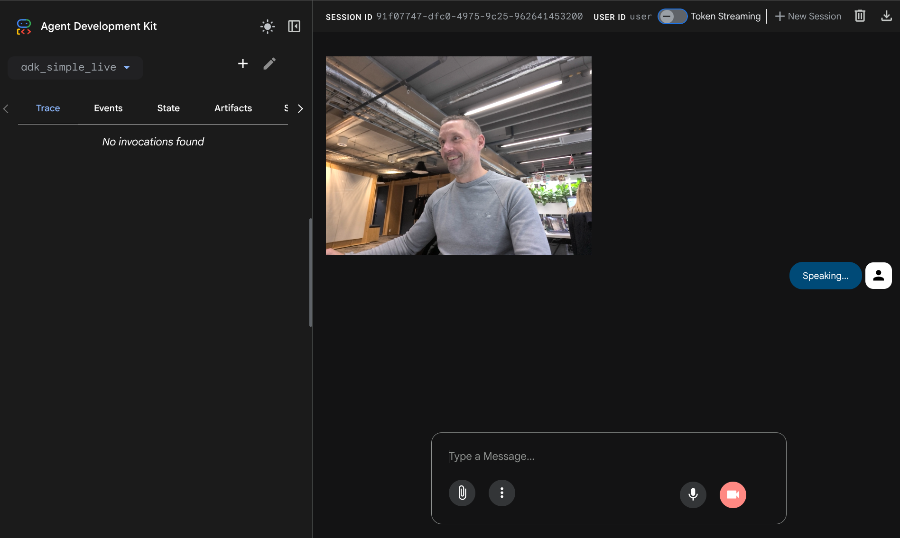

# adk-simple-live
Simple example of a custom Agent developed with ADK and published in GeminiEntreprise


## Pre-requisite

1. This example is meant to work with `python >= 3.12`
2. Make sure you have access to `UV` Python package manager in the command line. If not install from https://github.com/astral-sh/uv
3. Check out this repository somewhere where you have a terminal access `git clone git@github.com:jt151077/adk-simple-live.git`
4. For this example you need a GCP Project, as the artifacts will be deployed in Agent Engine, and the GeminiEntreprise provisioned in AI Applications


## Install


1. CD to the root of the project `adk-simple-live`, rename `.env.template` to `.env`, and provide the correct values in the `.env` file:

```shell
GOOGLE_GENAI_USE_VERTEXAI=TRUE
GOOGLE_CLOUD_PROJECT=<YOUR_GCP_PROJECT_ID>
GOOGLE_CLOUD_LOCATION=<YOUR_GCP_REGION>
AGENT_VERSION=x.x.x
GEMINI_ENT_REGION=global
AGENT_ENGINE_NAME='<THE_AGENT_NAME>' ## this will be the name visible in Agent Engine
GEMINI_ENT_DISPLAY_NAME='<THE_AGENT_NAME>' ## this will be the agent name in Agent Space
GEMINI_ENT_AGENT_DESCRIPTION='<THE_AGENT_DESCRIPTION>' ## this will be the agent description in Agent Space
```

2. At the root folder, execute the following commands:

```shell
uv venv
source .venv/bin/activate
uv pip install -e .
```

3. To test the code, you can use the graphical tool for ADK by launching:

```shell
adk web
```

This will start a webserver running on http://127.0.0.1:8000. By pointing your webbrowser to this address, you can test the code.

As an example, you can mention the country 'France'. This should display a nice dish from France and the latest football results as a bonus ;-)


4. Start the camera or the microphone and start interacting with the model:

